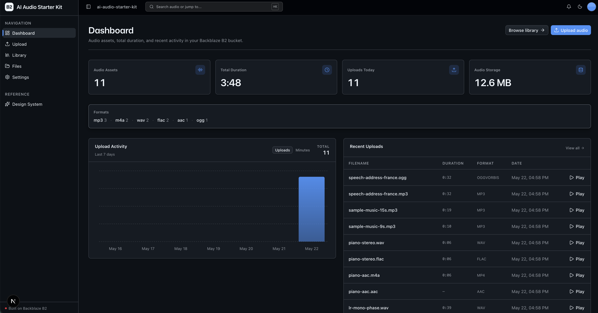
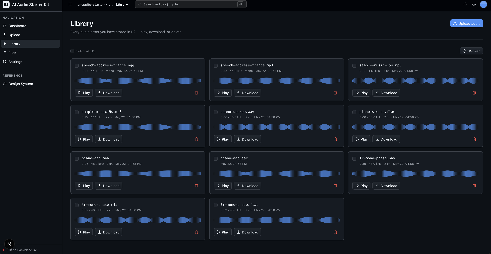

<!-- last_verified: 2026-05-21 -->
# AI Audio Starter Kit

Build AI audio applications with text-to-speech, speech-to-text, transcription, voice agents, music generation, and sound effects.

This is a **template** — not a finished app. It scaffolds everything an AI-audio app needs out of the box (drag-and-drop audio upload, an audio-aware Library with inline playback / waveform / download / delete, audio metadata extraction, audio-centric dashboard metrics, and the full bucket explorer) so a developer or coding agent can drop in their own audio feature without re-wiring the storage and UI plumbing. Storage is **[Backblaze B2](https://www.backblaze.com/sign-up/ai-cloud-storage?utm_source=github&utm_medium=referral&utm_campaign=ai_artifacts&utm_content=b2ai-ai-audio-starter-kit)** via the S3-compatible API — already integrated.

**What you get out of the box:**
- `/library` — audio asset grid with inline playback, waveform stub, download, and delete (scoped to the `audio/` prefix in B2)
- `/upload` — drag-and-drop audio upload with progress, queue, and server-side metadata extraction (`.wav` via stdlib `wave`, everything else via `mutagen`)
- `/files` — full B2 bucket explorer (tree view, preview, download, delete) for ops-style browsing of everything else in the bucket
- `/` (Dashboard) — total audio assets, total duration, recent uploads, daily activity
- `/design` — design system showcase including the **Audio Library Card** primitive
- FastAPI backend with strict layered architecture (`types -> config -> repo -> service -> runtime`) and structural tests
- Agent-optimized docs — your AI coding agent can read the repo and start contributing immediately

## What it looks like

**Dashboard** — audio asset count, total duration, format breakdown, and recent upload activity:



**Library** — audio asset grid with inline playback, waveform, download, and delete:




## Agent-First Architecture

This repo is optimized for coding agents. Use the template, point your agent at it, and start building.

The structure follows the principle that **repository knowledge is the system of record**. Anything an agent can't access in-context doesn't exist — so everything it needs to reason about the codebase is versioned, co-located, and discoverable from the repo itself.

### How it works

**[AGENTS.md](AGENTS.md) is the single source of truth for all coding agents.** A ~100 line entry point gives agents the repository layout, architectural invariants, commands, conventions, and pointers to deeper docs. Agent-specific files (CLAUDE.md, etc.) are thin pointers back to AGENTS.md.

**Architecture is enforced mechanically, not by convention.** Layering rules, import boundaries, file size limits, and SDK containment are verified by structural tests and lints that run on every change. When rules are enforceable by code, agents follow them reliably.

**The knowledge base is structured for progressive disclosure:**

```
AGENTS.md              Single source of truth — layout, invariants, commands, conventions
ARCHITECTURE.md        System layout, layering rules, data flows
docs/
  features/            Feature docs (inputs, outputs, flows, edge cases)
  app-workflows.md     User journeys
  dev-workflows.md     Engineering workflows and testing
  SECURITY.md          Security principles
  RELIABILITY.md       Reliability expectations
  exec-plans/          Execution plans and tech debt tracker
```

### Key design decisions

| Principle | Implementation |
|-----------|---------------|
| Give agents a single source of truth | AGENTS.md ~100 lines — layout, invariants, commands, conventions |
| Enforce invariants mechanically | Structural tests + ruff + ESLint verify boundaries |
| DRY documentation | Each fact lives in one place; no redundant files to drift |
| Strict layered architecture | `types -> config -> repo -> service -> runtime`, enforced by tests |
| Prefer boring, composable libraries | stdlib `wave` + `mutagen` for audio metadata, no ffmpeg |
| Contain external SDKs | `boto3` only in `repo/` layer — verified by structural test |
| Keep files agent-sized | 300-line limit per file, enforced by test |
| Docs updated with code | Same-PR requirement prevents documentation rot |
| Structured observability | JSON logging, `/metrics` endpoint, request tracing |

## Quick Start

You need: Node.js >= 20, pnpm >= 9, Python >= 3.11, and a free **[Backblaze B2 account](https://www.backblaze.com/sign-up/ai-cloud-storage?utm_source=github&utm_medium=referral&utm_campaign=ai_artifacts&utm_content=b2ai-ai-audio-starter-kit)**.

### Start a new project

**Option 1: GitHub Template (recommended)**

Click the green **"Use this template"** button at the top of this repo, name your project, then:

```bash
git clone https://github.com/yourorg/my-cool-audio-app.git
cd my-cool-audio-app
```

**Option 2: Clone and reinitialize**

```bash
git clone https://github.com/backblaze-b2-samples/ai-audio-starter-kit.git my-cool-audio-app
cd my-cool-audio-app
rm -rf .git
git init
git add .
git commit -m "Initial commit from ai-audio-starter-kit"
```

Either way you get a clean project with no upstream history — ready to push to your own repo and point your agent at it.

### Setup

**1. Install dependencies**

```bash
pnpm install
```

**2. Set up the backend**

```bash
cd services/api
python -m venv .venv && source .venv/bin/activate
pip install -r requirements.txt
cd ../..
```

**3. Add your B2 credentials**

Set up your local `.env`:

```bash
cp .env.example .env
```

Open `.env` in your editor and keep it visible. Then head to the [Backblaze B2 dashboard](https://secure.backblaze.com/b2_buckets.htm?utm_source=github&utm_medium=referral&utm_campaign=ai_artifacts&utm_content=b2ai-ai-audio-starter-kit) and:

1. **Create a bucket.** Use the bucket name and endpoint to fill these `.env` values:
   - **Bucket Unique Name** -> `B2_BUCKET_NAME`
   - **Region** (the path segment of the endpoint, e.g. `us-west-004`) -> `B2_REGION`
2. **Create an application key** with `Read and Write` permission. B2 will show two values — paste each into `.env`:
   - **keyID** -> `B2_APPLICATION_KEY_ID`
   - **applicationKey** -> `B2_APPLICATION_KEY` *(only shown once — paste it now)*

> Want a walkthrough? See the docs for [creating a bucket](https://www.backblaze.com/docs/cloud-storage-create-and-manage-buckets?utm_source=github&utm_medium=referral&utm_campaign=ai_artifacts&utm_content=b2ai-ai-audio-starter-kit) and [creating app keys](https://www.backblaze.com/docs/cloud-storage-create-and-manage-app-keys?utm_source=github&utm_medium=referral&utm_campaign=ai_artifacts&utm_content=b2ai-ai-audio-starter-kit).

**4. Run it**

```bash
pnpm dev
```

That's it. Frontend at `localhost:3000`, API at `localhost:8000`. Drop an audio file in `/upload` and see it appear in `/library`.

`pnpm dev` runs `pnpm doctor` first — a preflight check that catches the common setup gotchas (wrong Node/Python version, missing venv, missing or placeholder `.env`, ports already taken) and tells you exactly how to fix each one. Run it standalone any time with `pnpm doctor`.

## Core Features

- [Audio Library](docs/features/audio-library.md) — `/library` page with the `AudioAssetCard` grid: inline playback, waveform stub, download, delete. Scoped to the `audio/` prefix in B2.
- [Audio Upload](docs/features/file-upload.md) — drag-and-drop, progress, queue. Accepts `.wav / .mp3 / .flac / .ogg / .m4a / .aac / .opus`. Audio metadata extracted server-side on upload.
- [Audio Metadata Extraction](docs/features/audio-metadata.md) — duration, sample rate, channels, bit depth, codec. Stdlib `wave` + `mutagen`; no ffmpeg.
- [Bucket Explorer](docs/features/file-browser.md) — full B2 bucket tree view, for ops-style browsing of everything that isn't audio. Last item in nav.
- [Dashboard](docs/features/dashboard.md) — audio assets, total duration, recent activity chart, recent uploads table.
- [Audio Playback](docs/features/audio-playback.md) — presigned-URL flow, inline `<audio controls>`, expiry, content disposition.
- [Design System](docs/design-system.md) — tokens, primitives, AI elements, the blaze generating loader, the `AudioAssetCard` library primitive, and inline `ErrorState` / `EmptyState` patterns. Live preview at `/design`.

Plus the cross-cutting essentials inherited from the underlying starter:
- Inline error handling — fetch failures surface *what's wrong* (API offline, 401, 5xx) and offer a Retry
- Single-source config — one `.env` at the repo root powers both API and web app, validated at startup
- Centralized data layer — every fetch goes through TanStack Query hooks in `apps/web/src/lib/queries.ts`
- Structural tests — verify layering rules, import boundaries, SDK containment, file size limits
- Structured JSON logging — every request traced with `request_id` and timing
- `/health` endpoint — B2 connectivity check
- `/metrics` endpoint — Prometheus-format counters (request count, latency, uploads)

## Tech Stack

- TypeScript, Next.js 16, React 19, Tailwind v4, shadcn/ui, Recharts
- TanStack Query — caching, dedup, retry, stale-while-revalidate for every fetch
- Python 3.11+, FastAPI, boto3, Pydantic v2, `mutagen` (pure-Python audio metadata)
- Backblaze B2 (S3-compatible object storage)
- pnpm workspaces (monorepo)

## Commands

| Command | What it does |
|---------|-------------|
| `pnpm dev` | Start frontend + backend |
| `pnpm dev:web` | Frontend only |
| `pnpm dev:api` | Backend only |
| `pnpm build` | Build frontend |
| `pnpm lint` | Lint frontend |
| `pnpm lint:api` | Lint backend (ruff) |
| `pnpm test:api` | Run backend tests |
| `pnpm check:structure` | Verify layering rules |
| `pnpm test:e2e` | Playwright e2e tests (run `pnpm --filter @ai-audio-starter-kit/web exec playwright install chromium` once first) |

## Documentation Map

| Doc | Purpose |
|-----|---------|
| [AGENTS.md](AGENTS.md) | Agent table of contents — start here |
| [ARCHITECTURE.md](ARCHITECTURE.md) | System layout, layering, data flows |
| [docs/features/](docs/features/) | Feature docs (audio library, upload, metadata, browser, dashboard, playback) |
| [docs/design-system.md](docs/design-system.md) | Design tokens, primitives, AI elements, loader, the `AudioAssetCard` |
| [docs/app-workflows.md](docs/app-workflows.md) | User journeys |
| [docs/dev-workflows.md](docs/dev-workflows.md) | Engineering workflows and testing |
| [docs/SECURITY.md](docs/SECURITY.md) | Security principles |
| [docs/RELIABILITY.md](docs/RELIABILITY.md) | Reliability expectations |
| [docs/exec-plans/](docs/exec-plans/) | Execution plans and tech debt tracker |

## Contributing

Start with [AGENTS.md](AGENTS.md). It's the map — everything else is discoverable from there.

## License

MIT License — see [LICENSE](LICENSE) for details.

## Claude Agent B2 Skill

Manage Backblaze B2 from your terminal using natural language (list/search, audits, stale or large file detection, security checks, safe cleanup).

Repo: [https://github.com/backblaze-b2-samples/claude-skill-b2-cloud-storage](https://github.com/backblaze-b2-samples/claude-skill-b2-cloud-storage)
